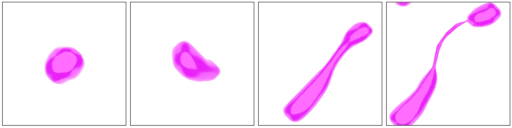

# strainBox

[](https://doi.org/10.5281/zenodo.20581132)
[](https://doi.org/10.1088/1742-6596/3230/1/012006)
[](http://www.tsfp-conference.org/proceedings/2026/262.pdf)



Measure the strain rate of a turbulent fluid surrounding a droplet.

`strainBox` is a post-processing code for 3D direct numerical simulations of a deformable drop (or bubble) in homogeneous turbulence in a periodic box. It reads saved flow fields, finds the drop, and computes:

- **Drop properties:** volume, surface area, curvature statistics, topology (genus), centre of mass, mean velocity, and inertia tensor with its eigenvalues (deformation).
- **Velocity-gradient tensor, strain rate, vorticity, and Reynolds-stress-like tensor**, evaluated over a range of regions around the drop (the drop itself, an equivalent ellipsoid, spheres and cubes of several radii, and the same regions placed on the far side of the periodic box as a control).

A Python script then turns the output into publication-style plots.

## Repository contents

| File | Purpose |
|---|---|
| `main.f90` | Main program (`dropStrain`). Reads fields, locates the drop, computes drop statistics, calls the strain routines, writes output. MPI-parallel over simulation runs. |
| `modVelGrad.f90` | Module with grid parameters and all velocity-gradient / mask-building routines. |
| `fftw3.f03` | FFTW's standard Fortran 2003 interface header (unmodified, included by `main.f90`). |
| `makefile` | Builds the `dropStrain` executable with `mpif90`. |
| `run.sh` | Example SLURM batch script (32 MPI ranks). |
| `plot.py` | Matplotlib scripts that read the output and make PDF figures. |
| `transpose.awk.sh` | Small helper that transposes a whitespace-separated text table. |

## Requirements

**To build and run `dropStrain`:**

- A Fortran compiler with MPI wrappers (`mpif90`; developed with gfortran, since the flags in the makefile are GNU-style)
- Parallel-enabled HDF5 with the Fortran interface (`libhdf5_fortran`, `libhdf5`)
- FFTW3, both double and single precision (`-lfftw3 -lfftw3f`); the code uses the single-precision (`fftwf_*`) routines
- LAPACK (`-llapack`), used for the symmetric eigenvalue solver `SSYEV`
- A Unix shell environment (the code shells out to `ls`, `mkdir`, `rm`)

**To make the plots:**

- Python 3 with `numpy` and `matplotlib`
- A working LaTeX installation (`plot.py` sets `text.usetex: True`)

**Memory:** all arrays are static and sized at compile time for the grid. At 256³ each MPI rank needs roughly 2 to 2.5 GB, which is why the makefile uses `-mcmodel=large`. Budget memory per rank accordingly.

## Building

1. Edit the top of `makefile` so `HDF5_INC` and `HDF5_LIB` point to your HDF5 installation:

   ```make
   HDF5_INC = /path/to/hdf5/include
   HDF5_LIB = /path/to/hdf5/lib
   ```

   The defaults point to a directory under `$(HOME)/drops/boxStrain/src/lib/hdf5_parallel/`, which will not exist on your machine.

2. Build:

   ```bash
   make          # produces ./dropStrain
   make clean    # removes the executable, *.o and *.mod
   ```

### Changing the grid size

The grid is set at compile time in `modVelGrad.f90`:

```fortran
integer, dimension(3), parameter :: nt = (/256,256,256/)       ! grid points
real, dimension(3), parameter :: dx = (/1.0,1.0,1.0/), l = nt*dx  ! spacing, box length
```

Edit `nt` and `dx` and rebuild. Note that `main.f90` also declares `velGHat` with `nt(1)` in its last two dimensions, so non-cubic grids will need that fixed.

## Input data

For every simulation run, the program expects a directory of HDF5 snapshots named `field*.h5`. Each file must contain these datasets:

| Dataset | Shape | Meaning |
|---|---|---|
| `c` | `nt(1) × nt(2) × nt(3)` | Phase field / volume fraction (the drop is where `c ≥ 0.9`) |
| `u`, `v`, `w` | `nt(1) × nt(2) × nt(3)` | Velocity components |
| `time` | scalar | Simulation time |
| `We` | scalar | Weber number |
| `Cn` | scalar | Cahn number |
| `res` | scalar | Resolution parameter |

The domain is assumed to be **periodic** in all three directions. Drops that straddle a boundary are handled by shifting the drop's mass histogram so it is contiguous.

Runs are directories whose names look like `run_break_024`: the program takes everything from the 11th character onward as an integer run number.

## Running

### Directly

```bash
mpirun -np 32 ./dropStrain
```

### On a SLURM cluster

`run.sh` is an example that requests 32 tasks for 2 days and loads Intel MPI:

```bash
sbatch run.sh
```

### How work is divided

Rank 0 lists the run directories into `dir_list.txt`. Each run is then assigned to the rank where `runNum mod nRanks == rank`, and that rank loops through all snapshots of the run in the order listed. Parallelism is therefore **across runs, not within a snapshot**: using more ranks than you have runs gains nothing, and a single run is processed serially. `dir_list.txt` is deleted at the end of the job.

---

## What the code computes

For each snapshot, `dropStrain` does the following.

1. **Identify the drop.** Cells with `c ≥ 0.9` are the drop. Interface normals come from central differences of `c`, and curvature is the divergence of the normal.
2. **Surface statistics.** Interface area is accumulated per cell from the dominant normal direction. Area-weighted mean and standard deviation of curvature are recorded, along with the mean inverse curvature and mean inverse squared curvature.
3. **Topology.** The Euler characteristic is computed from vertex, edge and face counts of the voxelised drop (using a painter-style algorithm at each cell vertex, following Mendoza et al., *Acta Mater.* 2006), giving the genus (tunnels minus voids). A warning is printed if the Euler characteristic comes out odd.
4. **Position and shape.** The centre of mass is found in a way that is robust to periodic wrap-around. The moment-of-inertia tensor is built from the voxels, diagonalised with LAPACK, and the deformation is `sqrt(I_max / I_min)`. If the drop spans the whole domain, deformation is reported as `-1`.
5. **Velocity gradients.** The velocity-gradient tensor `∂u_i/∂x_j` and the associated tensor `⟨u_i u_j⟩` are estimated over each region below, then reduced to strain tensor, strain eigenvalues, vorticity, and the `Q` and `R` invariants.

### Regions used for the velocity gradient

`R` runs over five radii `R = L/12 × {1,2,3,4,5}`, which at 256³ correspond to labels `021`, `043`, `064`, `085`, `107`.

| Output name | Region | Method |
|---|---|---|
| `Drop` | The actual drop | Finite difference of velocity across the drop, along grid lines through it |
| `DropAv` | The actual drop | Volume average of a spectrally computed gradient, with 2/3 dealiasing |
| `Ellipse` | Ellipsoid with the same inertia tensor and volume as the drop | Same as `Drop` |
| `BoxR###` | Cube centred on the drop | Finite difference across the cube faces |
| `SphereR###` | Sphere centred on the drop | Same as `Drop` |
| `SphereAvR###` | Sphere centred on the drop | Same as `DropAv` |
| `ModesR###` | Sphere in Fourier space, centred on the drop | Gradient from Fourier modes with wavelength larger than `R` |
| `FarBoxR###`, `FarSphereR###`, `FarSphereAvR###`, `FarModesR###` | Same shapes but centred on the opposite side of the periodic box | Control measurement of the background turbulence away from the drop |

## Output

Results go to `output/<runName>/`. All files are plain text, one row per snapshot, with columns in scientific notation. Files are opened in append mode in the sense that each snapshot adds a row.

### Drop statistics (in `output/<runName>/`)

| File | Columns |
|---|---|
| `statDrops.txt` | time, drop size (cells), area, deformation, mean curvature, curvature std dev, `last0(1:3)`, `last1(1:3)` (start/end indices of the drop in each direction), mean 1/curvature, mean 1/curvature² |
| `posiDrops.txt` | time, x, y, z of the drop centre |
| `veloDrops.txt` | time, mean drop velocity (3), mean of velocity squared (3) |
| `MoInDrops.txt` | time, 3 inertia eigenvalues (ascending), then 9 values of the 3×3 matrix. This matrix holds the **eigenvectors** after LAPACK's `SSYEV` call, so the columns are the principal axes. |
| `topoDrops.txt` | time, vertices, edges, faces, genus |

### Velocity-gradient files (in `output/<runName>/<quantity>/<Region>.txt`)

| Directory | Columns |
|---|---|
| `dVeldx/` | time, Q, R, then the 9 components of `∂u_i/∂x_j` |
| `strain/` | time, 3 strain-rate eigenvalues (ascending), then the 9-element matrix (eigenvectors after `SSYEV`) |
| `ReStress/` | time, 3 eigenvalues, then the 9-element matrix (eigenvectors after `SSYEV`) |
| `vortic/` | time, vorticity vector (3) |

`<Region>` is one of the names in the table above, for example `strain/SphereR085.txt` or `dVeldx/Drop.txt`.

## Plotting

`plot.py` contains one function per figure, for example:

`areaVsTime`, `strainVsTime`, `QRVsTime`, `vortVsTime`, `energyVsTime`, `axesLenVsTime`, `aspectRatioVsTime`, `dissVsTime`, `survivalVsTime`, `MoIAlignStrainVsTime`, `MoIDotStrainVsDelay`, `surPowVsWaveNumber`, `energyVsWaveNumber`, and others.

At the bottom of the file the calls are commented out. **Uncomment the function(s) you want** and run:

```bash
mkdir -p plots
python plot.py
```

Figures are saved as PDFs (transparent background) in `plots/`. At the time of this release the only active call is `MoIDotStrainVsDelay()`, which looks at the alignment of the drop's inertia axes with the strain-rate eigenvectors as a function of time delay.

`plot.py` is set up for four Weber numbers (`we_02`, `we_05`, `we_08`, `we_10`; We = 0.02, 0.05, 0.08, 0.10) and computes derived quantities such as the Ohnesorge number and the Hinze diameter for each. Strains are non-dimensionalised using the drop diameter and dissipation rate, and time is shown relative to the breakup time `t_b` in units of the drop's eddy turnover time `t_d`.

Some plots (`ESpec`, `FSpec`, forcing/energy spectra) use `ESpec.txt` and `FSpec.txt` files that are written by the simulation code, **not** by `dropStrain`.

### Transposing a table

```bash
./transpose.awk.sh input.txt > output.txt
```

## Citing

If you use this software, please cite the archived release:

> I. Cannon, *strainBox* (v1.0), Zenodo. doi: [10.5281/zenodo.20581132](https://doi.org/10.5281/zenodo.20581132)

```bibtex
@software{cannon_strainbox,
  author  = {Cannon, Ianto},
  title   = {strainBox},
  version = {v1.0},
  year    = {2026},
  doi     = {10.5281/zenodo.20581132},
  url     = {https://doi.org/10.5281/zenodo.20581132}
}

@article{cannon2026strain,
  author  = {Cannon, Ianto and Mor{\'o}n, Daniel and Vela-Mart{\'\i}n, Alberto and Avila, Marc},
  title   = {Strain-driven drop breakup in turbulence},
  journal = {Journal of Physics: Conference Series},
  volume  = {3230},
  pages   = {012006},
  year    = {2026},
  doi     = {10.1088/1742-6596/3230/1/012006}
}

@inproceedings{cannon2026spectra,
  author    = {Cannon, Ianto and Mor{\'o}n, Daniel and Avila, Marc and Vela-Mart{\'\i}n, Alberto},
  title     = {Spatio-temporal energy spectra of drops in turbulence},
  booktitle = {14th International Symposium on Turbulence and Shear Flow Phenomena (TSFP14)},
  address   = {Heidelberg, Germany},
  month     = jul,
  year      = {2026},
  url       = {http://www.tsfp-conference.org/proceedings/2026/262.pdf}
}
